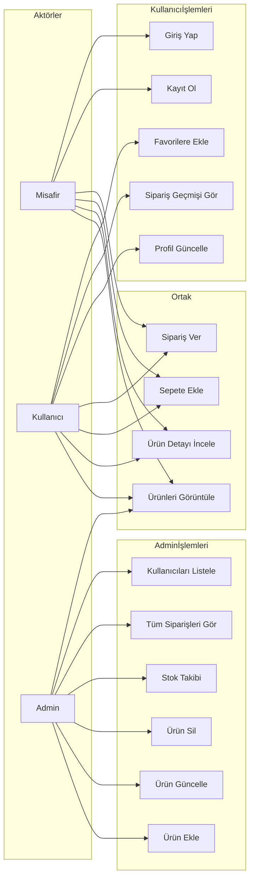
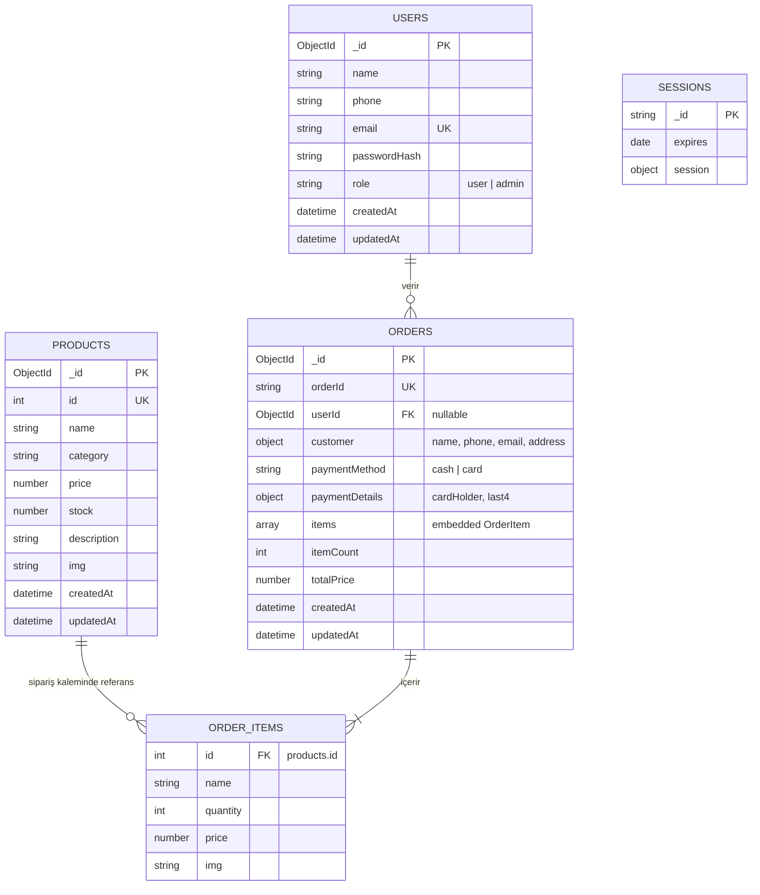

# GETİR GÖTÜR — Proje Teslim Raporu

**Ders:** Sistem Analizi ve Tasarımı  
**Program:** Bilgisayar Teknolojisi  
**Kurum:** Kırıkhan Meslek Yüksekokulu  
**Proje adı:** Getir Götür — Online Market / E-Ticaret Uygulaması

---

## 1. Projenin Genel Tanımı

**Getir Götür**, kullanıcıların ürünlerini çevrimiçi olarak inceleyip sepete ekleyebildiği, sipariş verebildiği ve yöneticilerin ürün, stok ve siparişleri yönetebildiği bir web uygulamasıdır.

Uygulama; hızlı teslimat konseptine uygun bir **online market** senaryosunu modellemektedir. Müşteriler ürünleri kategorilere göre listeleyebilir, detay sayfasında inceleyebilir, favorilere ekleyebilir, sepet oluşturup ödeme adımına geçebilir. Kayıtlı kullanıcılar profil bilgilerini güncelleyebilir ve geçmiş siparişlerini görüntüleyebilir. Yönetici (admin) rolündeki kullanıcılar ise ürün ekleme/güncelleme/silme, stok takibi, sipariş listeleme ve kayıtlı kullanıcıları görüntüleme işlemlerini gerçekleştirir.

Proje, ders gereksinimlerinde belirtilen **görsel kullanıcı arayüzü**, **veritabanı kullanımı** ve **farklı kullanıcı rolleri / yetki seviyeleri** kriterlerini karşılamaktadır.

---

## 2. Kullanılan Teknolojiler

| Katman         | Teknoloji                       | Açıklama                                |
| -------------- | ------------------------------- | --------------------------------------- |
| **Frontend**   | React 19                        | Kullanıcı arayüzü bileşenleri           |
|                | React Router 7                  | Sayfa yönlendirme (SPA)                 |
|                | Vite 7                          | Geliştirme sunucusu ve derleme aracı    |
|                | Tailwind CSS 4                  | Arayüz stilleri                         |
|                | Axios                           | Backend API istekleri                   |
| **Backend**    | Node.js + Express 5             | REST API sunucusu                       |
|                | Mongoose 8                      | MongoDB ODM (veri modelleme)            |
|                | express-session + connect-mongo | Oturum yönetimi                         |
|                | bcryptjs                        | Şifre hashleme                          |
|                | Zod                             | İstek doğrulama (validation)            |
| **Veritabanı** | MongoDB                         | NoSQL veritabanı                        |
| **Geliştirme** | concurrently                    | Frontend + backend eşzamanlı çalıştırma |
|                | nodemon                         | Backend otomatik yeniden başlatma       |

**Mimari:** İstemci–sunucu (client–server) mimarisi. Frontend `http://localhost:5173`, backend API `http://localhost:5000` adresinde çalışır. Vite geliştirme modunda `/api` isteklerini backend'e proxy eder.

---

## 3. Kullanıcı Rolleri ve Yetkiler

| Rol                          | Açıklama                   | Yetkiler                                                                    |
| ---------------------------- | -------------------------- | --------------------------------------------------------------------------- |
| **Misafir (giriş yapmamış)** | Kayıt olmadan gezebilir    | Ürün listeleme, detay görüntüleme, sepete ekleme, sipariş verme (oturumsuz) |
| **Kullanıcı (user)**         | Kayıt/giriş yapmış müşteri | Misafir yetkileri + profil güncelleme, sipariş geçmişi, favoriler           |
| **Yönetici (admin)**         | Sistem yöneticisi          | Ürün CRUD, stok takibi, tüm siparişleri görme, kullanıcı listesi            |

Yetki kontrolü backend tarafında `requireAuth` ve `requireAdmin` middleware fonksiyonları ile sağlanır.

**Varsayılan admin hesabı** (ilk çalıştırmada otomatik oluşturulur):

- E-posta: `admin@gmail.com`
- Şifre: `admin123`

---

## 4. Uygulama Özellikleri

### 4.1 Müşteri (Kullanıcı) Özellikleri

- Ana sayfada ürün listeleme ve sayfalama
- Kategori filtreleme
- Ürün detay sayfası
- Sepete ürün ekleme / miktar güncelleme / silme
- Favorilere ekleme (tarayıcıda localStorage)
- Kayıt olma ve giriş yapma
- Ödeme: kapıda ödeme veya kredi kartı (simülasyon)
- Sipariş onay sayfası
- Kullanıcı paneli: profil düzenleme, sipariş geçmişi

### 4.2 Yönetici Özellikleri

- Yeni ürün ekleme
- Mevcut ürünü düzenleme ve silme
- Stok takibi (5 ve altı kritik stok uyarısı)
- Tüm siparişleri listeleme
- Kayıtlı kullanıcıları görüntüleme

### 4.3 Sistem Özellikleri

- Sipariş oluşturulurken stok kontrolü ve otomatik stok düşümü
- Oturum tabanlı kimlik doğrulama (session cookie)
- API istek doğrulama (Zod şemaları)

---

## 5. Kullanım Senaryosu (Use-Case) Diyagramı

Aşağıdaki diyagram, sistemin temel aktörlerini ve yapılabilecek işlemleri göstermektedir.



**Use-case açıklamaları:**

| Use-case                      | Aktör     | Açıklama                                          |
| ----------------------------- | --------- | ------------------------------------------------- |
| Ürünleri Görüntüle            | Herkes    | Ana sayfada ürün kartları listelenir              |
| Ürün Detayı İncele            | Herkes    | `/product/:id` sayfasında ürün bilgisi            |
| Sepete Ekle                   | Herkes    | Sepet tarayıcıda (localStorage + context) tutulur |
| Sipariş Ver                   | Herkes    | Checkout → ödeme → sipariş kaydı                  |
| Kayıt Ol / Giriş Yap          | Misafir   | Modal üzerinden auth işlemleri                    |
| Profil Güncelle               | Kullanıcı | `/user-panel` sayfası                             |
| Sipariş Geçmişi Gör           | Kullanıcı | Kendi siparişleri listelenir                      |
| Ürün Yönetimi                 | Admin     | `/admin-panel` — ekleme, düzenleme, silme         |
| Stok Takibi                   | Admin     | Kritik stok uyarıları                             |
| Sipariş / Kullanıcı Listeleme | Admin     | Tüm kayıtlar görüntülenir                         |

---

## 6. Veritabanı İlişki Diyagramı (ER)

MongoDB doküman tabanlı bir veritabanıdır. Aşağıda koleksiyonlar, alanlar, anahtarlar ve ilişkiler gösterilmiştir.



### Koleksiyon detayları

**users**

- `_id`: MongoDB ObjectId (birincil anahtar)
- `email`: Benzersiz (unique), giriş için kullanılır
- `role`: `user` veya `admin`
- `passwordHash`: Düz metin şifre saklanmaz

**products**

- `_id`: MongoDB ObjectId
- `id`: Uygulama seviyesinde sayısal benzersiz kimlik (API'de kullanılır)
- `stock`: Sipariş verildiğinde azaltılır

**orders**

- `orderId`: Benzersiz sipariş numarası (ör. `GG-1712345678901`)
- `userId`: Kayıtlı kullanıcıya referans (giriş yapmamışsa `null`)
- `items`: Gömülü dizi (OrderItem); ürün bilgilerinin anlık kopyası
- `customer`: Teslimat bilgileri (sipariş anındaki müşteri verisi)

**sessions**

- Express oturum verileri; `connect-mongo` tarafından yönetilir

---

## 7. Kurulum ve Çalıştırma Talimatları

Projeyi başka bir bilgisayarda çalıştırmak için aşağıdaki adımları izleyin.

### 7.1 Gereksinimler

- **Node.js** 18 veya üzeri ([https://nodejs.org](https://nodejs.org))
- **MongoDB** 6 veya üzeri ([https://www.mongodb.com/try/download/community](https://www.mongodb.com/try/download/community))
- İnternet bağlantısı (ilk `npm install` için)

Kurulumu doğrulamak için terminalde:

```bash
node -v
npm -v
mongod --version
```

### 7.2 Projeyi İndirme

Kaynak kodları GitHub deposundan klonlayın veya teslim edilen ZIP arşivini açın:

```bash
git clone <GITHUB_REPO_URL>
cd Getirgotur
```

### 7.3 Ortam Değişkenlerini Ayarlama

```bash
cp backend/.env.example backend/.env
```

`backend/.env` dosyasını düzenleyin. En azından `MONGODB_URI` değerini kendi MongoDB adresinize göre ayarlayın:

```
MONGODB_URI=mongodb://127.0.0.1:27017/getirgotur
```

### 7.4 Bağımlılıkları Yükleme

Proje kök dizininde:

```bash
npm install
npm --prefix backend install
```

### 7.5 MongoDB'yi Başlatma

MongoDB servisinizin çalıştığından emin olun. macOS'ta genellikle:

```bash
brew services start mongodb-community
```

Windows'ta MongoDB Compass veya servis yöneticisi üzerinden başlatılabilir.

### 7.6 Veritabanı Yedeğini İçe Aktarma (Opsiyonel ama Önerilir)

Teslim paketindeki `teslim/veritabani_yedegi/` klasöründeki JSON dosyalarını yüklemek için:

```bash
cd tools/db-backup
npm install
node importDb.js --clean
```

`--clean` parametresi mevcut koleksiyonları temizleyip yedeği sıfırdan yükler.

### 7.7 Uygulamayı Çalıştırma

Proje kök dizininde tek komutla hem backend hem frontend başlatılır:

```bash
npm run dev:all
```

Alternatif olarak ayrı terminallerde:

```bash
# Terminal 1 — Backend
cd backend
npm run dev

# Terminal 2 — Frontend
npm run dev
```

### 7.8 Uygulamaya Erişim

| Adres                            | Açıklama                   |
| -------------------------------- | -------------------------- |
| http://localhost:5173            | Web arayüzü (ana uygulama) |
| http://localhost:5000/api/health | Backend sağlık kontrolü    |

Backend ilk çalıştırmada admin kullanıcısını otomatik oluşturur (`admin@gmail.com` / `admin123`).

### 7.9 Üretim Derlemesi (Opsiyonel)

```bash
npm run build
npm --prefix backend start
```

`vite build` çıktısı `dist/` klasörüne yazılır. Statik dosyalar bir web sunucusu veya Express static middleware ile servis edilebilir.

---

## 8. Veritabanı Yedeği — Dışa ve İçe Aktarma

### 8.1 Teslim Edilen Yedek

`teslim/veritabani_yedegi/` klasöründe şu dosyalar bulunur:

| Dosya           | İçerik                                     |
| --------------- | ------------------------------------------ |
| `users.json`    | Kullanıcı kayıtları                        |
| `products.json` | Ürün kayıtları                             |
| `orders.json`   | Sipariş kayıtları                          |
| `sessions.json` | Oturum kayıtları                           |
| `manifest.json` | Yedek meta bilgisi (tarih, kayıt sayıları) |

### 8.2 Yedeği Başka Bilgisayara Aktarma

1. MongoDB'nin hedef bilgisayarda çalıştığından emin olun.
2. `backend/.env` içinde `MONGODB_URI` değerini ayarlayın.
3. Şu komutları çalıştırın:

```bash
cd tools/db-backup
npm install
node importDb.js --clean
```

### 8.3 Güncel Yedek Alma

Kendi veritabanınızdan yeni yedek almak için:

```bash
cd tools/db-backup
npm install
node exportDb.js
```

Çıktı `teslim/veritabani_yedegi/` klasörüne yazılır.

### 8.4 MongoDB Compass ile Alternatif Yöntem

1. MongoDB Compass'ı açın.
2. `MONGODB_URI` ile bağlanın.
3. `getirgotur` veritabanını seçin.
4. Her koleksiyon için **Export** → JSON formatında dışa aktarın.
5. İçe aktarmak için **Import** kullanın.

---

## 9. Kullanım Kılavuzu (Özet)

### 9.1 Müşteri Akışı

1. Ana sayfayı açın (`http://localhost:5173`).
2. Ürünleri inceleyin; kategori veya sayfalama ile gezinin.
3. Bir ürüne tıklayarak detay sayfasına gidin.
4. **Sepete Ekle** ile ürün ekleyin.
5. Sağ üstten sepete gidin, miktarları kontrol edin.
6. **Ödemeye Geç** ile teslimat bilgilerini doldurun.
7. Kapıda ödeme veya kredi kartı (simülasyon) seçin.
8. Sipariş onay sayfasında sipariş numaranızı görün.

**Kayıtlı kullanıcı için ek adımlar:**

- Sağ üstten **Kayıt Ol** veya **Giriş Yap**.
- **Kullanıcı Paneli**'nden profil ve sipariş geçmişine erişin.

### 9.2 Yönetici Akışı

1. `admin@gmail.com` / `admin123` ile giriş yapın.
2. Menüden **Admin Paneli**'ne gidin (`/admin-panel`).
3. Sol taraftan yeni ürün ekleyin veya mevcut ürünü düzenleyin/silin.
4. Sağ tarafta tüm ürünler, siparişler ve kullanıcılar listelenir.
5. Stok 5 ve altına düşen ürünler **Stok Takibi** bölümünde uyarı olarak görünür.

### 9.3 Görsel Kılavuzlar

Projede ek görsel kılavuzlar mevcuttur:

- `kullanım_kılavuzu/GETİR GÖTÜR HULLANIM KILAVUZU.png`
- `kullanım_kılavuzu/GETİRGÖTÜR.png` (akış diyagramı)
- `kullanım_kılavuzu/Ön_rapor.pdf`
- `veri_tabanı.png` (veritabanı şeması)
- `onbirinci_h_akis_diyagramı.png` (11. hafta akış diyagramı)

---

## 10. Proje Dosya Yapısı

```
Getirgotur/
├── backend/                 # Express API sunucusu
│   ├── src/
│   │   ├── models/          # User, Product, Order şemaları
│   │   ├── routes/          # auth, products, orders, users
│   │   ├── middleware/      # Yetki kontrolü
│   │   ├── seed/            # Admin kullanıcı oluşturma
│   │   ├── utils/           # DB bağlantısı
│   │   ├── app.js
│   │   └── server.js
│   └── .env.example
├── src/                     # React frontend
│   ├── component/           # Sayfa bileşenleri
│   ├── context/             # Sepet ve favori state
│   └── api/                 # Backend istekleri
├── tools/
│   ├── db-backup/           # Veritabanı yedekleme araçları
│   └── fake-data/           # Sahte veri üretimi (araştırma)
├── teslim/
│   ├── PROJE_RAPORU.md      # Bu rapor
│   └── veritabani_yedegi/   # JSON veritabanı yedeği
├── kullanım_kılavuzu/       # Görsel kılavuzlar
└── package.json
```

---

## 11. API Uç Noktaları (Özet)

| Metot  | Endpoint             | Yetki     | Açıklama          |
| ------ | -------------------- | --------- | ----------------- |
| GET    | `/api/health`        | Herkes    | Sunucu durumu     |
| POST   | `/api/auth/register` | Herkes    | Kayıt             |
| POST   | `/api/auth/login`    | Herkes    | Giriş             |
| POST   | `/api/auth/logout`   | Oturumlu  | Çıkış             |
| GET    | `/api/auth/me`       | Herkes    | Mevcut kullanıcı  |
| GET    | `/api/products`      | Herkes    | Ürün listesi      |
| GET    | `/api/products/:id`  | Herkes    | Ürün detayı       |
| POST   | `/api/products`      | Admin     | Ürün ekle         |
| PUT    | `/api/products/:id`  | Admin     | Ürün güncelle     |
| DELETE | `/api/products/:id`  | Admin     | Ürün sil          |
| POST   | `/api/orders`        | Herkes    | Sipariş oluştur   |
| GET    | `/api/orders/my`     | Kullanıcı | Kendi siparişleri |
| GET    | `/api/orders`        | Admin     | Tüm siparişler    |
| GET    | `/api/users`         | Admin     | Kullanıcı listesi |
| PUT    | `/api/users/me`      | Kullanıcı | Profil güncelle   |

---

## 12. Teslim Paketi İçeriği

Ders gereksinimlerine göre arşiv dosyasında şunlar bulunmalıdır:

| İçerik                     | Konum                       | Durum                           |
| -------------------------- | --------------------------- | ------------------------------- |
| Kaynak kodlar              | Proje kökü                  | Hazır                           |
| Proje raporu               | `teslim/PROJE_RAPORU.md`    | Hazır                           |
| Veritabanı yedeği          | `teslim/veritabani_yedegi/` | Hazır                           |
| Kurulum talimatları        | Bu rapor — Bölüm 7          | Hazır                           |
| DB içe aktarma talimatları | Bu rapor — Bölüm 8          | Hazır                           |
| Use-case diyagramı         | Bu rapor — Bölüm 5          | Hazır                           |
| ER diyagramı               | Bu rapor — Bölüm 6          | Hazır                           |
| Tanıtım videosu            | —                           | Öğrenci tarafından hazırlanacak |

---

## 13. Bilinen Sınırlamalar

- Kredi kartı ödemesi gerçek bir ödeme altyapısına bağlı değildir; yalnızca simülasyondur.
- Favoriler tarayıcı `localStorage`'da tutulur; sunucu tarafında saklanmaz.
- Sepet verisi de istemci tarafında tutulur; sayfa temizlenirse sepet boşalabilir.
- Üretim ortamı için HTTPS, güçlü `SESSION_SECRET` ve ek güvenlik önlemleri önerilir.

---

_Bu rapor, Sistem Analizi ve Tasarımı dersi final teslimi kapsamında hazırlanmıştır._
